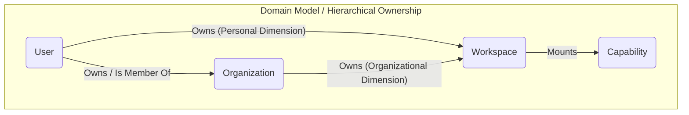

# Architecture Diagrams

## Domain Model / Hierarchical Ownership Diagram

```mermaid
graph TD
    subgraph Domain Model / Hierarchical Ownership
        U(User)
        O(Organization)
        W(Workspace)
        C(Capability)

        U -- "Owns (Personal Dimension)" --> W
        U -- "Owns / Is Member Of" --> O
        O -- "Owns (Organizational Dimension)" --> W
        W -- "Mounts" --> C
    end
```
