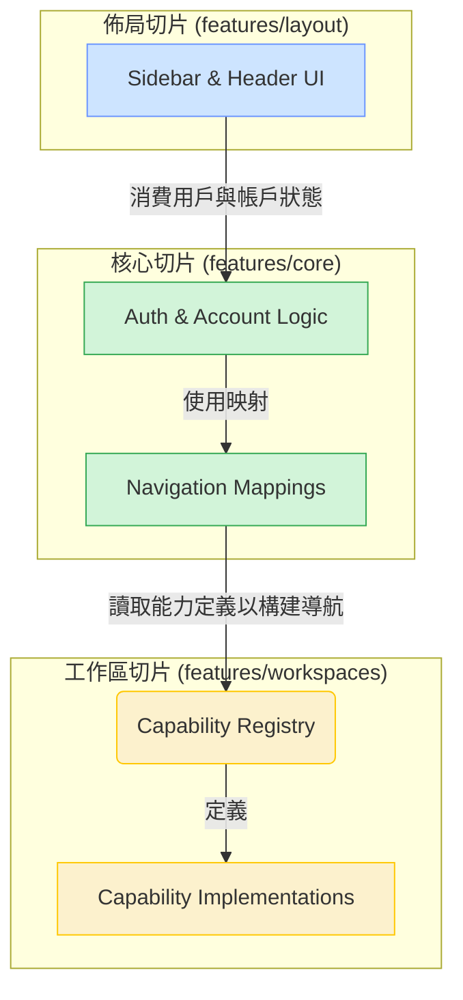
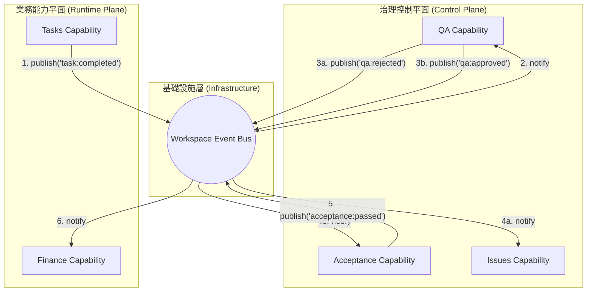

# 專案互動模型 (Interaction Model)

本文件使用圖表來視覺化地展示系統中核心模組之間的數據流與控制流，基於我們定義的「功能切片」架構原則。

## 1. 高階功能切片交互圖 (High-Level Feature Slice Interaction)

此圖展示了 `layout`, `core`, 和 `workspaces` 三大切片如何協同工作，以構建完整的應用程式 UI。

**交互解讀**:

1.  **單向依賴流 (`layout` -> `core` -> `workspaces`)**:
    *   `佈局切片 (A)` 為了顯示用戶資訊和帳戶切換器，需要消費 `核心切片 (B)` 提供的狀態。
    *   `核心切片 (C)` 為了構建主導航欄，需要讀取 `工作區切片 (D)` 中定義的能力清單。
    *   `工作區切片 (D, E)` 位於依賴鏈的最底層，它不了解任何上層切片的存在。

2.  **映射的職責**: `Navigation Mappings (C)` 扮演了關鍵的「適配器」角色。它將 `workspaces` 提供的「所有可用能力」轉化為 `layout` 需要的「應顯示在導航欄上的能力」。

---

## 2. 工作區內部通訊模型 (Intra-Workspace Communication)

此圖展示在單一工作區內部，不同的「能力」之間如何通過事件總線進行解耦通訊。

**交互解讀**:

1.  **無直接耦合**: 請注意，「治理控制平面」和「業務能力平面」中的任何能力之間都沒有直接的連接線。
2.  **事件驅動**: 所有交互都是異步的、事件驅動的。
    *   `Tasks` 能力在一個任務完成時，只會向 `Event Bus` 發布一個 `task:completed` 事件，它並不知道誰會關心這個事件。`QA` 能力訂閱了這個事件，並將該任務加入其待審核佇列。
3.  **可擴展性**: 這種模式非常靈活。如果我們想在任務被拒絕時通知管理員，我們只需要讓一個新的「通知能力」也訂閱 `qa:rejected` 事件即可，無需修改任何現有程式碼。
