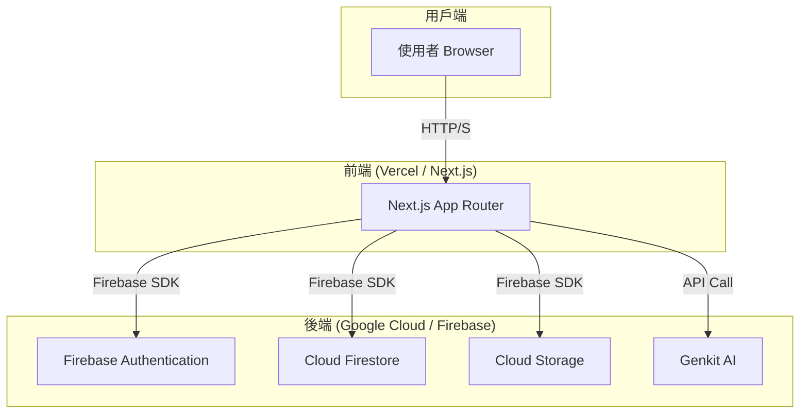

# 1. 系統架構總覽 (System Architecture)

這張圖展示了應用的高層次技術堆疊，說明了前端、後端服務以及它們之間的關係。

```mermaid
graph TD
    subgraph "用戶端"
        A[使用者 Browser]
    end

    subgraph "前端 (Vercel / Next.js)"
        B[Next.js App Router]
    end

    subgraph "後端 (Google Cloud / Firebase)"
        C[Firebase Authentication]
        D[Cloud Firestore]
        E[Cloud Storage]
        F[Genkit AI]
    end

    A -- HTTP/S --> B
    B -- Firebase SDK --> C
    B -- Firebase SDK --> D
    B -- Firebase SDK --> E
    B -- API Call --> F
```
