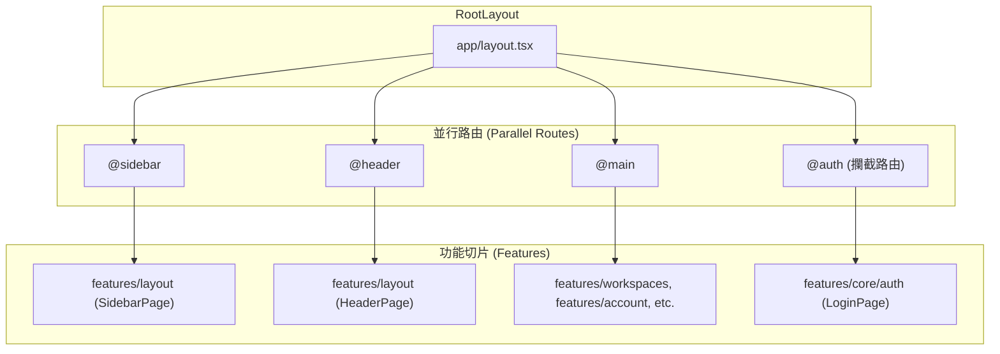

# 2. App Shell 與並行路由 (App Shell & Parallel Routing)

此圖說明了 Next.js 的 App Router 如何利用並行路由 (`@main`, `@sidebar`, `@header`, `@auth`) 來組織整個應用的 UI 佈局，以及 `core` 功能切片如何填充這些槽位。

```mermaid
graph TD
    subgraph "RootLayout"
        A["app/layout.tsx"]
    end

    subgraph "並行路由 (Parallel Routes)"
        B["@sidebar"]
        C["@header"]
        D["@main"]
        E["@auth (攔截路由)"]
    end

    subgraph "功能切片 (Features)"
        F["features/layout (SidebarPage)"]
        G["features/layout (HeaderPage)"]
        H["features/workspaces, features/account, etc."]
        I["features/core/auth (LoginPage)"]
    end

    A --> B
    A --> C
    A --> D
    A --> E

    B --> F
    C --> G
    D --> H
    E --> I
```
