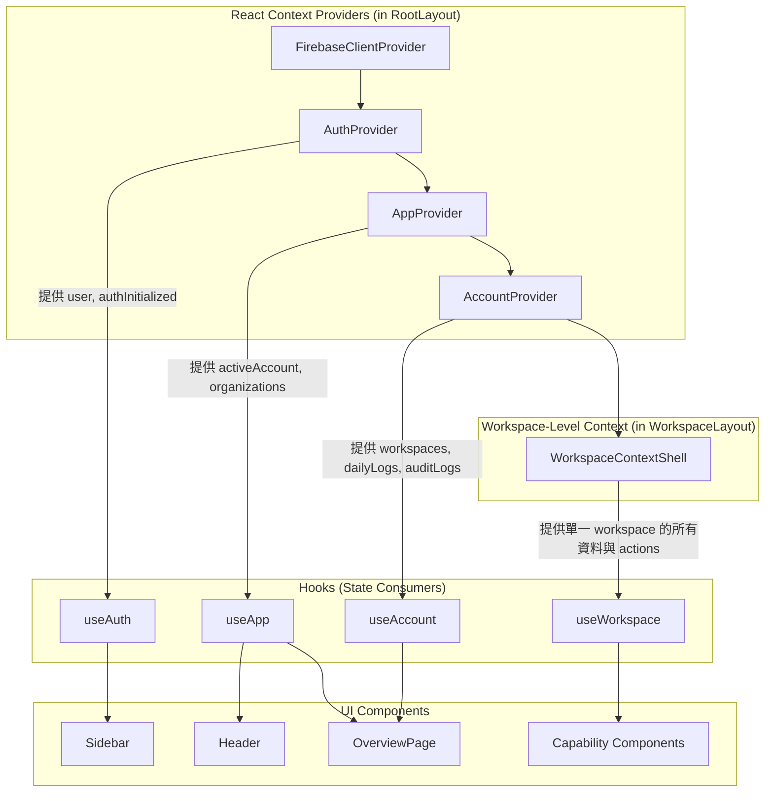

# 3. 狀態管理層級與資料流 (State Management & Data Flow)

此圖視覺化了多層級 React Context 的供應鏈，展示了資料如何從頂層 Provider 流向各個頁面和元件，以及 Hooks 如何消費這些狀態。

```mermaid
graph TD
    subgraph "React Context Providers (in RootLayout)"
        P1[FirebaseClientProvider] --> P2[AuthProvider]
        P2 --> P3[AppProvider]
        P3 --> P4[AccountProvider]
    end

    subgraph "Workspace-Level Context (in WorkspaceLayout)"
        P4 --> P5[WorkspaceContextShell]
    end

    subgraph "Hooks (State Consumers)"
        H_Auth[useAuth]
        H_App[useApp]
        H_Account[useAccount]
        H_Workspace[useWorkspace]
    end

    subgraph "UI Components"
        C_Sidebar[Sidebar]
        C_Header[Header]
        C_Overview[OverviewPage]
        C_WorkspaceCap[Capability Components]
    end

    P2 -- "提供 user, authInitialized" --> H_Auth
    P3 -- "提供 activeAccount, organizations" --> H_App
    P4 -- "提供 workspaces, dailyLogs, auditLogs" --> H_Account
    P5 -- "提供單一 workspace 的所有資料與 actions" --> H_Workspace

    H_Auth --> C_Sidebar
    H_App --> C_Header
    H_App --> C_Overview
    H_Account --> C_Overview
    H_Workspace --> C_WorkspaceCap
```
