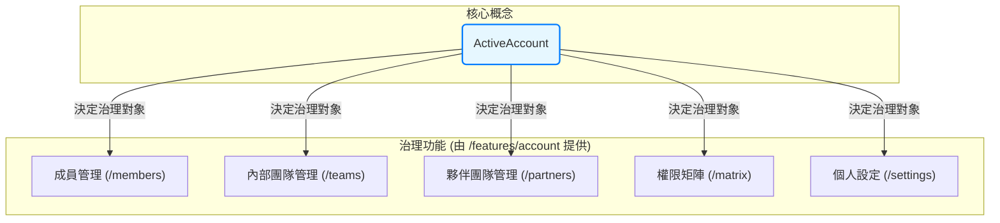

# 4. 帳戶治理模型 (Account Governance Model)

此圖專注於 `account` 功能，展示其各個子功能（如成員、團隊管理）是如何圍繞「`activeAccount`」這個核心概念運作的。

```mermaid
graph TD
    subgraph "核心概念"
        A(ActiveAccount)
    end

    subgraph "治理功能 (由 /features/account 提供)"
        B["成員管理 (/members)"]
        C["內部團隊管理 (/teams)"]
        D["夥伴團隊管理 (/partners)"]
        E["權限矩陣 (/matrix)"]
        F["個人設定 (/settings)"]
    end

    A -- "決定治理對象" --> B
    A -- "決定治理對象" --> C
    A -- "決定治理對象" --> D
    A -- "決定治理對象" --> E
    A -- "決定治理對象" --> F

    classDef core fill:#e6f7ff,stroke:#007bff,stroke-width:2px;
    class A core;
```
