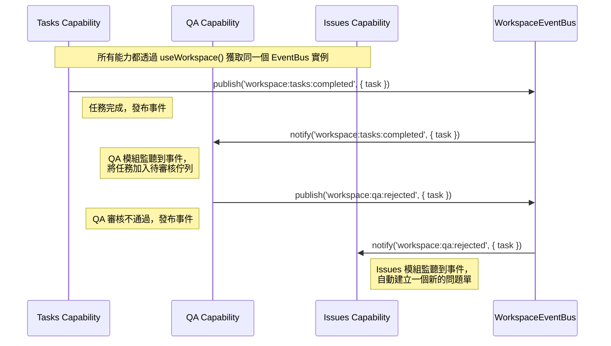

# 6. 能力事件匯流排交互 (Capability Event Bus Interaction)

此圖展示了各個獨立的「能力」之間如何透過非同步的 `WorkspaceEventBus` 進行通訊，以保持解耦。

```mermaid
sequenceDiagram
    participant T as Tasks Capability
    participant QA as QA Capability
    participant I as Issues Capability
    participant EB as WorkspaceEventBus

    Note over T, I: 所有能力都透過 useWorkspace() 獲取同一個 EventBus 實例

    T ->> EB: publish('workspace:tasks:completed', { task })
    Note right of T: 任務完成，發布事件

    EB ->> QA: notify('workspace:tasks:completed', { task })
    Note left of QA: QA 模組監聽到事件，<br/>將任務加入待審核佇列

    QA ->> EB: publish('workspace:qa:rejected', { task })
    Note left of QA: QA 審核不通過，發布事件

    EB ->> I: notify('workspace:qa:rejected', { task })
    Note right of I: Issues 模組監聽到事件，<br/>自動建立一個新的問題單
```
