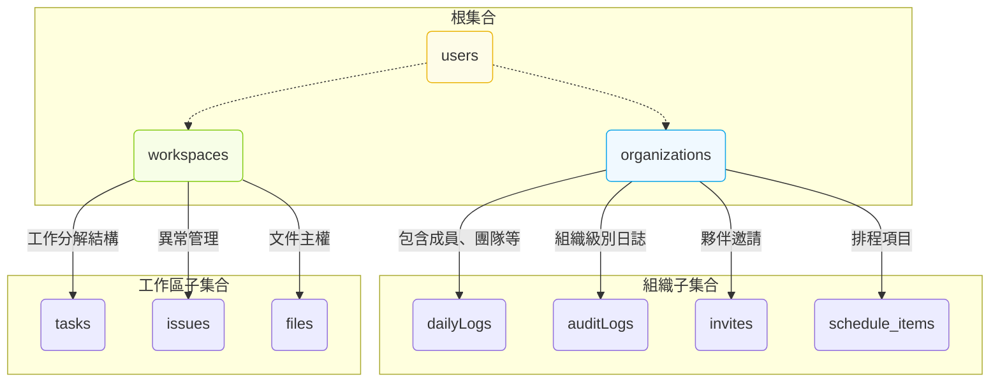

# 7. Firestore 資料模型 (Data Model)

此圖描繪了 Firestore 中主要集合與其子集合的結構和關係。

```mermaid
graph TD
    subgraph "根集合"
        Users(users)
        Orgs(organizations)
        Workspaces(workspaces)
    end

    subgraph "組織子集合"
        DailyLogs(dailyLogs)
        AuditLogs(auditLogs)
        Invites(invites)
        Schedule(schedule_items)
    end
    
    subgraph "工作區子集合"
        Tasks(tasks)
        Issues(issues)
        Files(files)
    end

    Orgs -- "包含成員、團隊等" --> DailyLogs
    Orgs -- "組織級別日誌" --> AuditLogs
    Orgs -- "夥伴邀請" --> Invites
    Orgs -- "排程項目" --> Schedule

    Workspaces -- "工作分解結構" --> Tasks
    Workspaces -- "異常管理" --> Issues
    Workspaces -- "文件主權" --> Files

    Users -.-> Orgs
    Users -.-> Workspaces

    style Users fill:#fefce8,stroke:#eab308
    style Orgs fill:#f0f9ff,stroke:#0ea5e9
    style Workspaces fill:#f7fee7,stroke:#84cc16
```
