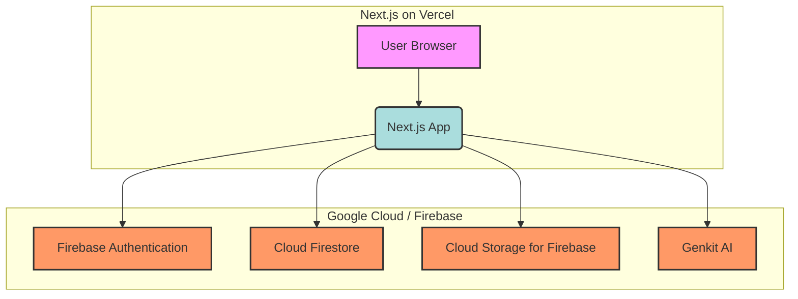
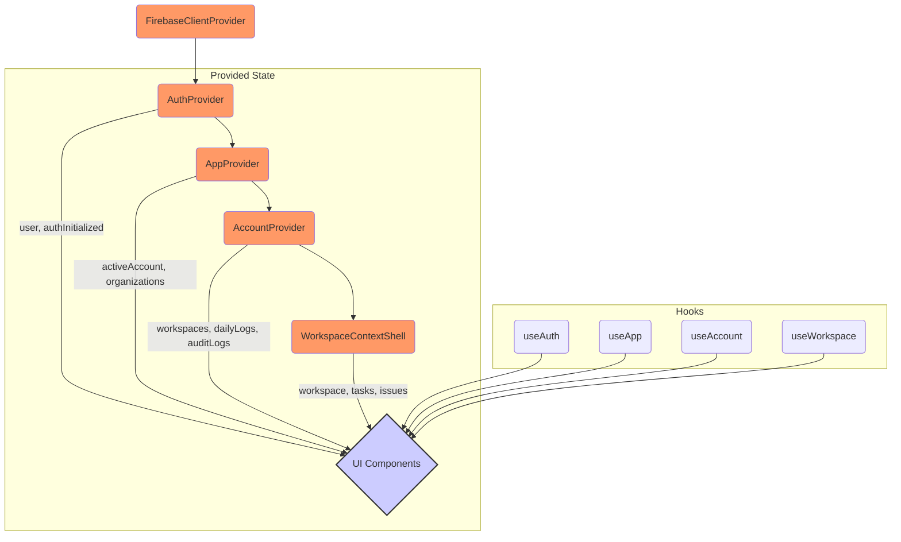
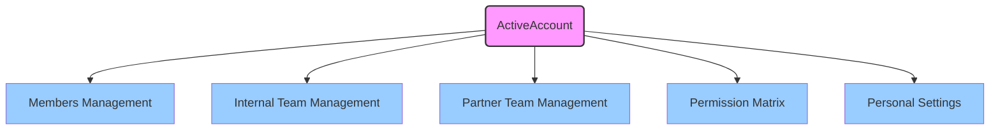
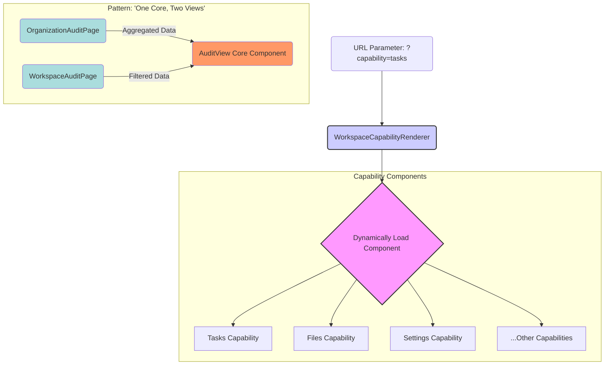
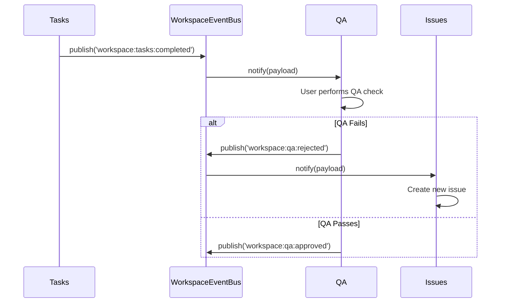
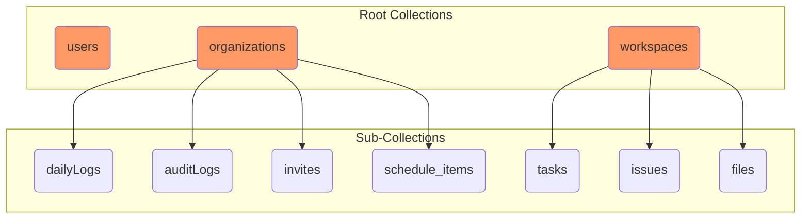

# Architecture: Core Principles & Responsibilities

This AI's primary directive is to assist with development by **proactively using the available tools** to understand the application's real-time state before making changes.

- **Tool-First Approach**: Before any code modification, I will use `nextjs_index` and `nextjs_call` to query the running application's routes, component structure, and error states.
- **Documentation-Driven**: I will use `nextjs_docs` to get accurate API information. I will not rely on prior knowledge.
- **Efficiency**: I will leverage code generation tools (`shadcn`) and project analysis tools (`repomix`) where appropriate to ensure efficient and accurate task completion.

---

# OrgVerse Architecture

This document contains a series of diagrams that describe the architecture of the OrgVerse application.

---

## 1. System Architecture

This diagram provides a high-level overview of the entire system, including the frontend, backend services, and their interactions.



---

## 2. App Shell & Parallel Routing

This diagram illustrates how Next.js Parallel Routes are used to create the main application shell.

```mermaid
graph TD
    subgraph App Router Structure
        A(app/layout.tsx) --> B(@sidebar);
        A --> C(@header);
        A --> D(@main);
        A --> E(@auth);
    end

    subgraph Feature Slices
        F[features/layout] --> B;
        F --> C;
        G[features/workspaces] --> D;
        H[features/core/auth] --> E;
    end

    style A fill:#ccf,stroke:#333,stroke-width:2px;
    style B fill:#add,stroke:#333,stroke-width:2px;
    style C fill:#add,stroke:#333,stroke-width:2px;
    style D fill:#add,stroke:#333,stroke-width:2px;
    style E fill:#add,stroke:#333,stroke-width:2px;
```

---

## 3. State Management & Data Flow

This diagram shows the hierarchy of React Context providers and how state flows through the application.



---

## 4. Account Governance Model

This diagram details the components that make up the account governance feature slice.



---

## 5. Workspace & Capability System

This diagram explains the modular "Capability" system within a workspace.



---

## 6. Event Bus Interaction

This sequence diagram illustrates how decoupled communication between capabilities is achieved using an event bus.



---

## 7. Firestore Data Model

This diagram outlines the primary collections and sub-collections in the Firestore database.



---

## 8. Authentication Flow

This diagram shows the user authentication flow, highlighting the use of Next.js Intercepted Routes for the login modal.

```mermaid
graph TD
    subgraph "Scenario 1: Direct Navigation"
        A[User visits /login] --> B(Render /login Page);
    end

    subgraph "Scenario 2: Intercepted Route"
        C[User on / clicks 'Login'] --> D{Next.js Router};
        D -- "Intercepts navigation" --> E(Render @auth/(.)login/page.tsx);
        E --> F[Show Login Modal];
    end

    style A fill:#ccf;
    style B fill:#add;
    style C fill:#ccf;
    style D fill:#f9f;
    style E fill:#add;
    style F fill:#9cf;
```
