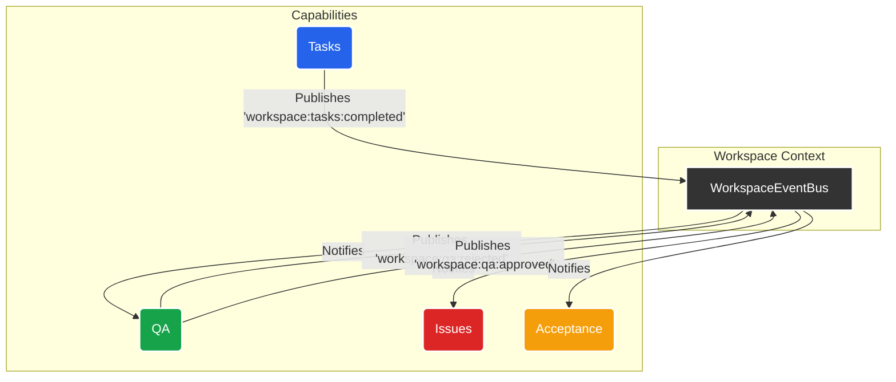
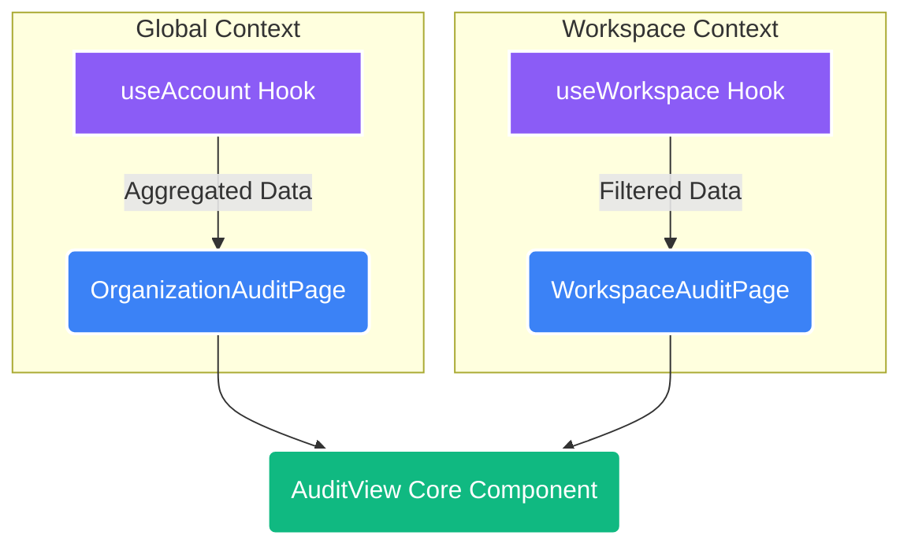

# Architecture: Workspace Feature Slice & Capability System

## 1. Responsibility

The `workspaces` feature slice is the heart of this application's business logic. It is responsible for managing everything related to "Workspaces," which are self-contained logical environments. This includes:

-   The list view of all workspaces (`/workspaces`).
-   The detailed view of a single workspace, which acts as a container or "shell" (`/workspaces/[id]`).
-   The entire pluggable **Capability System**, which allows modular features to be mounted into a workspace.

## 2. Core Architectural Pattern: The Shell & The Kernel

This feature slice follows a "Shell and Kernel" model:

-   **The Shell (`_components/shell/` & `_context/workspace-context.tsx`)**: This is the container. `WorkspaceLayout` and `WorkspaceContextShell` provide the stable, persistent frame and context for a single workspace. It knows *that* capabilities exist but not *what* they are. Its job is to load and display the correct capability.
-   **The Kernel (`capabilities/`)**: This is the dynamic content. Each subdirectory within `capabilities` is an independent, encapsulated feature module.

## 3. The Capability System

### Guiding Principle: Absolute Encapsulation & Event-Driven Communication

A Capability (e.g., `tasks`, `files`, `qa`) is a completely self-contained module.

-   **The Golden Rule**: A Capability MUST NEVER directly import code from another Capability.
-   **Communication Protocol**: All communication between capabilities MUST happen asynchronously via the `WorkspaceEventBus` provided by the `useWorkspace()` hook.

### The "One Core, Two Views" Pattern

To avoid code duplication, we use a single core view component that can be rendered in different contexts.

-   **Pain Point**: Needing to show the same data (e.g., audit logs) in both an aggregated organization-wide view and a filtered workspace-specific view.
-   **Solution**: Create a "dumb" view component (e.g., `AuditView`) and two "smart" container components that provide the appropriate data.

## 4. Boundary Rules

-   **Data Source**: The `workspaces` list page consumes data from the `useApp()` and `useAccount()` hooks. Individual workspace pages consume data from the `WorkspaceContext`.
-   **No External Feature Dependencies**: This feature MUST NOT depend on the `core` feature slice (e.g., `auth`, `account`). It receives all necessary user and account information via context.
